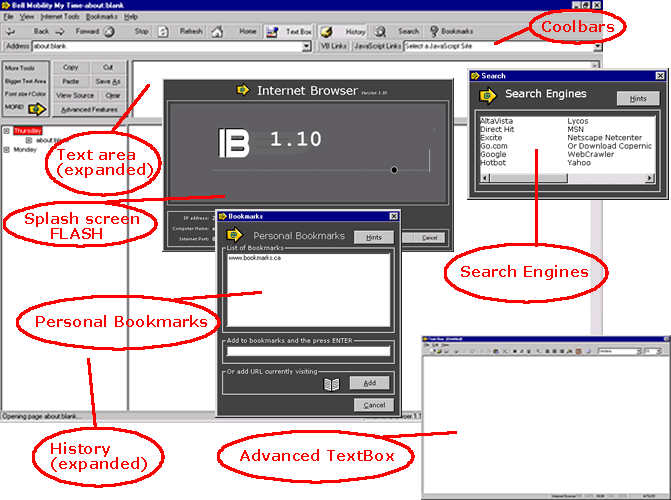



## \_\_ Not just another pretty Browser \- This has it \*ALL\* \_\_

### Description

First --> Thanks for downloading this application, and i know there

is a lot to look at in this readme, but it tells you about

this application, features and components installed.

Second -> Clicking the exe will not work. There are support files

needed. The bookmarks.txt, history.txt, TIPOFDAY.txt is

needed, as well as the FLASH movie. Put all of the files

in one dir, then click the exe.

Third -> There is an bug in the history section. You cannot have

duplicate days in the history. For example if you opened

the app on tuesday, it works. Wed, thurs, fri, sat, sun, mon.

it works. But the next tuesday it doesnt open. You need to

open the history and erase the contents. This needs work

i know, but i wanted to get version 1.10 out. Its loaded with

tons of other cool and useful tolls for net surfing programmers

( check out the text / box and advanced text box ) and nosey

people (check out the internet tools). v 2.0 will have this fixed.

Fourth -> Check out the features.

This is, without a doubt the most complex and complete browser

available *WITH* source code! And its all FREE!

Read the README.txt - it has a list of all the features! There are too many to fit in the description box (4000 char max).
 
### More Info
 
read the readme

the best browser to be posted on planet source code!

only the one bug (will fix for v2.0) - it is in the history.txt. If the day you open it is the same day that is in it an error will occur. To fix look at history_backup.txt - apologies for the error - everything else works great!

             |
---                |---
**Submitted On**   |2001-04-16 10:15:28
**By**             |[paul\_cormie](https://github.com/Planet-Source-Code/PSCIndex/blob/master/ByAuthor/paul-cormie.md)
**Level**          |Intermediate
**User Rating**    |4.5 (195 globes from 43 users)
**Compatibility**  |VB 5\.0, VB 6\.0
**Category**       |[Complete Applications](https://github.com/Planet-Source-Code/PSCIndex/blob/master/ByCategory/complete-applications__1-27.md)
**World**          |[Visual Basic](https://github.com/Planet-Source-Code/PSCIndex/blob/master/ByWorld/visual-basic.md)
**Archive File**   |[\_\_ Not jus184554162001\.zip](https://github.com/Planet-Source-Code/paul-cormie-not-just-another-pretty-browser-this-has-it-all__1-22459/archive/master.zip)

